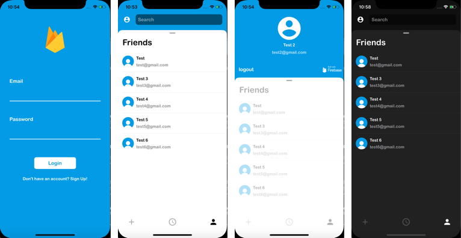

## Screenshots

### Instructions
In order to test the demo you need to:
1. Add your generated `GoogleService-Info.plist` file from your firebase console to the project.
2. In the terminal run `$ pod install` in the project directory.
3. Use the `.xcworkspace` file to run the demo.
## Credit
[DesignableX](https://github.com/bigmountainstudio/DesignableX)
